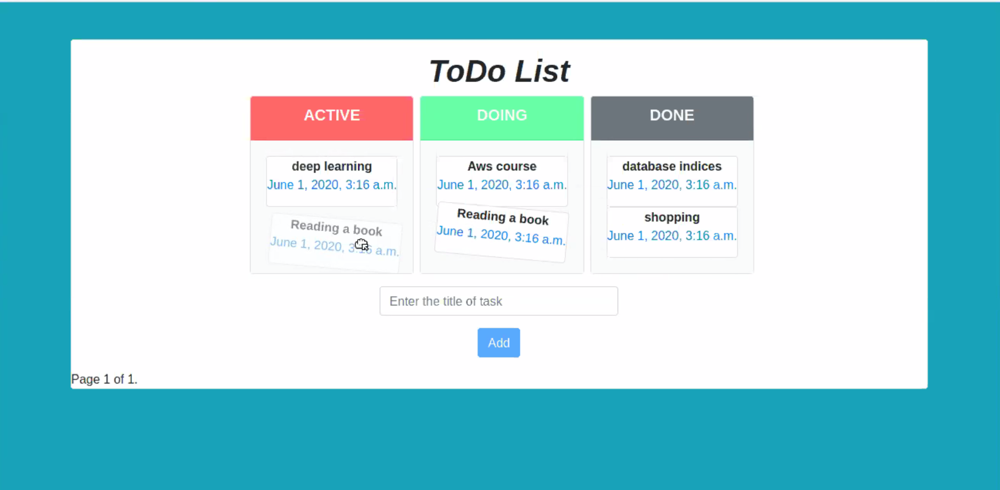

#TO DO List
####a list of tasks that need to be done.
## APIs

##### Get all Todos
- URL("/tasks") go to function index in views file in tasks app:
get tasks and divide returned data and display it on multiple pages orderd inversely by publish date . also preparing and displaying the links to the various pages.
- URL("tasks/add") go to add function in the same file:
you can call this as AJAX request by type the task in text input in index.html template that rendered by index function mentioned before nd press add button
- URL ("tasks/id") go to change_status function located in same file of index and add.
you can call this as AJAX request by drag and drop task's cards over three devs (Active,Doing,Done) which change the status of draged task.

## Images

